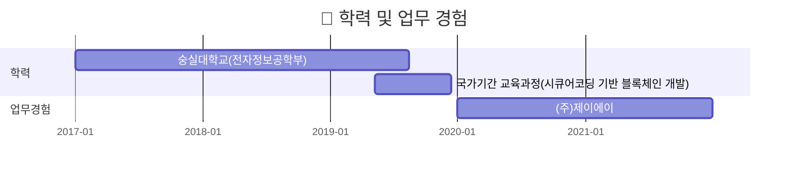
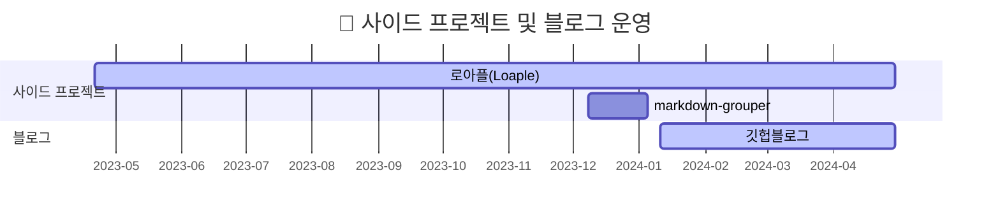

## 개발자 방혜찬의 프로필
프론트엔드 개발을 좋아하는 꿈나무 방혜찬입니다. 😄

숭실대학교 전자정보공학부를 졸업했습니다.

이 Github에는 그동안 **개발한 사이드 프로젝트, 공부한 내용들과 블로그** 등 모든 활동이 업로드 되어있습니다.

---

## 타임라인

## 업무 경험
**(주)제이에이 : _2020-01-01 ~ 2021-12-31_**

기초 데이터 분석 교육과정 강사

 

## 사이드 프로젝트
### 로아플(Loaple)
:calendar: **`2023/04/21 ~ 2024/04/24(임시 폐쇄)`**

온라인 게임 **로스트아크** 유저를 위한 사용자 경험 최적화 웹 서비스

_서버 비용 문제로 임시 폐쇄중입니다._

- ~~https://loaple.site~~
- https://github.com/momo1108/LostarkProject

 

### markdown-grouper
:calendar: **`2023/12/08 ~ 2024/01/05`**

NPM 에 업로드되어있는 1인 제작 패키지입니다.

HTML을 Markdown으로 변환하는 과정에서 문단별로 섹션을 나누기 위한 기능을 제공합니다.

- https://www.npmjs.com/package/markdown-grouper
- https://github.com/momo1108/markdown-grouper

## 개인 블로그
:calendar: **`2024/01/11 ~ 운영중`**

Github Pages 로 호스팅한 개인 블로그입니다.

Ruby 언어의 Jekyll 을 사용하여 개발되었습니다.

- https://momo1108.github.io/

## Contact
- banghyechan@gmail.com
- momo1108@daum.net
